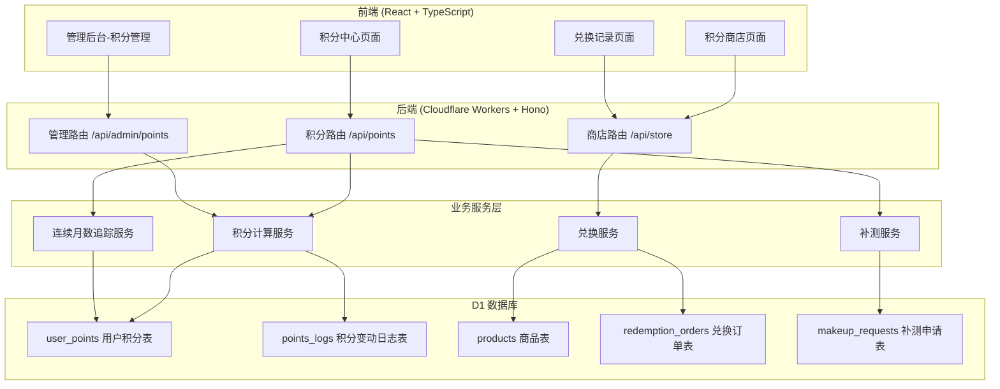
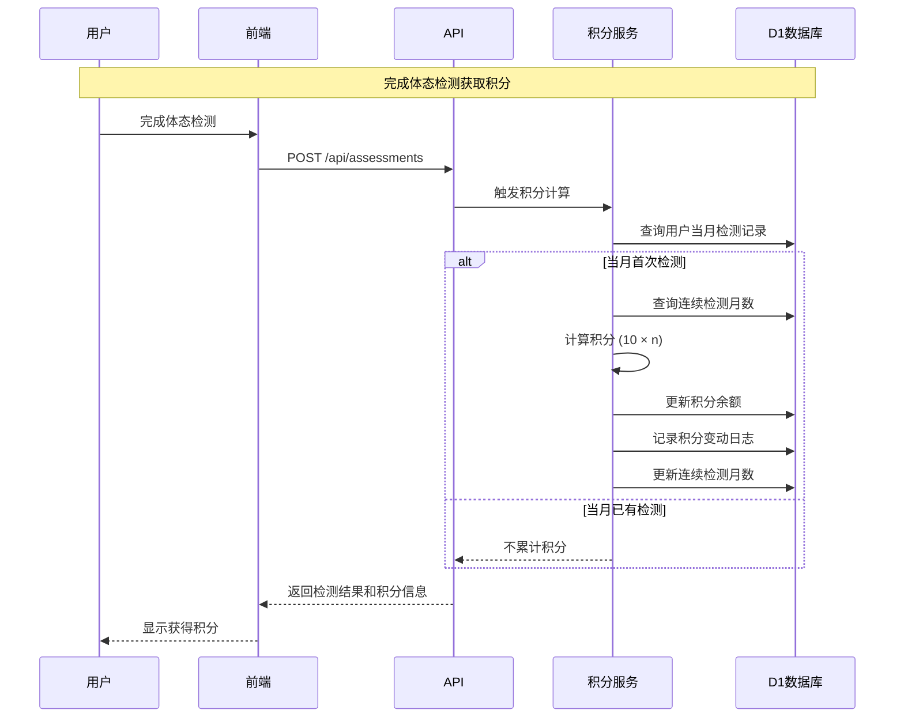

# 设计文档

## 概述

积分奖励制度是儿童青少年体态检测平台的激励功能模块，旨在通过积分机制鼓励用户持续参与体态检测。系统采用现有的 Cloudflare Workers + Hono + D1 技术栈，与现有的用户认证和体态检测功能无缝集成。

核心设计原则：
- **增量式积分**：连续检测月数越多，单月获得积分越高（10×n分）
- **连续性激励**：中断检测将重置连续月数，鼓励持续参与
- **门槛兑换**：需连续3个月检测方可兑换，确保用户真正参与
- **补测容错**：提供次月5日前的补测机会，增加用户友好度

## 架构

### 系统架构图



### 数据流图



## 组件和接口

### 后端 API 接口

#### 积分模块 (`/api/points`)

| 方法 | 路径 | 描述 | 请求体 | 响应 |
|------|------|------|--------|------|
| GET | `/api/points/summary` | 获取用户积分概览 | - | `{ balance, consecutiveMonths, nextReward, canRedeem }` |
| GET | `/api/points/history` | 获取积分变动历史 | - | `{ logs: PointLog[] }` |
| POST | `/api/points/makeup/apply` | 申请补测 | `{ targetMonth }` | `{ success, requestId }` |
| GET | `/api/points/makeup/status` | 查询补测申请状态 | - | `{ requests: MakeupRequest[] }` |

#### 商店模块 (`/api/store`)

| 方法 | 路径 | 描述 | 请求体 | 响应 |
|------|------|------|--------|------|
| GET | `/api/store/products` | 获取商品列表 | - | `{ products: Product[] }` |
| GET | `/api/store/products/:id` | 获取商品详情 | - | `{ product: Product }` |
| POST | `/api/store/redeem` | 兑换商品 | `{ productId, quantity }` | `{ success, orderId }` |
| GET | `/api/store/orders` | 获取兑换订单列表 | - | `{ orders: Order[] }` |

#### 管理模块 (`/api/admin/points`)

| 方法 | 路径 | 描述 | 请求体 | 响应 |
|------|------|------|--------|------|
| GET | `/api/admin/points/users` | 获取用户积分列表 | - | `{ users: UserPoints[] }` |
| GET | `/api/admin/points/users/:id` | 获取用户积分详情 | - | `{ user: UserPointsDetail }` |
| POST | `/api/admin/points/users/:id/adjust` | 调整用户积分 | `{ amount, reason }` | `{ success }` |
| GET | `/api/admin/products` | 获取商品管理列表 | - | `{ products: Product[] }` |
| POST | `/api/admin/products` | 添加商品 | `Product` | `{ success, productId }` |
| PUT | `/api/admin/products/:id` | 更新商品 | `Product` | `{ success }` |
| DELETE | `/api/admin/products/:id` | 删除/下架商品 | - | `{ success }` |
| GET | `/api/admin/orders` | 获取订单管理列表 | - | `{ orders: Order[] }` |
| PUT | `/api/admin/orders/:id/status` | 更新订单状态 | `{ status }` | `{ success }` |
| GET | `/api/admin/makeup-requests` | 获取补测申请列表 | - | `{ requests: MakeupRequest[] }` |
| PUT | `/api/admin/makeup-requests/:id` | 审核补测申请 | `{ approved }` | `{ success }` |

### 前端组件

```
src/
├── pages/
│   ├── PointsCenter.tsx        # 积分中心页面
│   ├── PointsStore.tsx         # 积分商店页面
│   ├── RedemptionHistory.tsx   # 兑换记录页面
│   └── admin/
│       ├── PointsManagement.tsx    # 用户积分管理
│       ├── ProductManagement.tsx   # 商品管理
│       └── OrderManagement.tsx     # 订单管理
├── components/
│   ├── points/
│   │   ├── PointsSummary.tsx       # 积分概览卡片
│   │   ├── PointsHistory.tsx       # 积分历史列表
│   │   ├── MakeupRequestForm.tsx   # 补测申请表单
│   │   └── ConsecutiveMonthsBadge.tsx  # 连续月数徽章
│   └── store/
│       ├── ProductCard.tsx         # 商品卡片
│       ├── ProductGrid.tsx         # 商品网格
│       ├── RedeemModal.tsx         # 兑换确认弹窗
│       └── OrderCard.tsx           # 订单卡片
└── api/
    ├── points.ts               # 积分相关API
    └── store.ts                # 商店相关API
```

## 数据模型

### 数据库表结构

#### user_points（用户积分表）

```sql
CREATE TABLE IF NOT EXISTS user_points (
  id INTEGER PRIMARY KEY AUTOINCREMENT,
  user_id INTEGER NOT NULL UNIQUE,
  balance INTEGER DEFAULT 0,              -- 当前积分余额
  total_earned INTEGER DEFAULT 0,         -- 累计获得积分
  total_spent INTEGER DEFAULT 0,          -- 累计消费积分
  consecutive_months INTEGER DEFAULT 0,   -- 连续检测月数
  last_detection_month TEXT,              -- 最后检测月份 (YYYY-MM)
  streak_start_month TEXT,                -- 连续检测开始月份 (YYYY-MM)
  created_at DATETIME DEFAULT CURRENT_TIMESTAMP,
  updated_at DATETIME DEFAULT CURRENT_TIMESTAMP,
  FOREIGN KEY (user_id) REFERENCES users(id)
);
```

#### points_logs（积分变动日志表）

```sql
CREATE TABLE IF NOT EXISTS points_logs (
  id INTEGER PRIMARY KEY AUTOINCREMENT,
  user_id INTEGER NOT NULL,
  change_type TEXT NOT NULL,              -- detection, makeup, redeem, admin_adjust
  change_amount INTEGER NOT NULL,         -- 变动数量（正数增加，负数减少）
  balance_after INTEGER NOT NULL,         -- 变动后余额
  reference_id INTEGER,                   -- 关联ID（检测ID/订单ID等）
  reference_type TEXT,                    -- 关联类型
  description TEXT,                       -- 变动描述
  operator_id INTEGER,                    -- 操作人ID（管理员调整时）
  created_at DATETIME DEFAULT CURRENT_TIMESTAMP,
  FOREIGN KEY (user_id) REFERENCES users(id)
);
```

#### products（商品表）

```sql
CREATE TABLE IF NOT EXISTS products (
  id INTEGER PRIMARY KEY AUTOINCREMENT,
  name TEXT NOT NULL,                     -- 商品名称
  description TEXT,                       -- 商品描述
  image_url TEXT,                         -- 商品图片URL
  points_required INTEGER NOT NULL,       -- 所需积分
  min_consecutive_months INTEGER DEFAULT 3, -- 最低连续月数要求
  stock INTEGER DEFAULT 0,                -- 库存数量
  category TEXT,                          -- 商品分类
  is_active INTEGER DEFAULT 1,            -- 是否上架
  sort_order INTEGER DEFAULT 0,           -- 排序权重
  created_at DATETIME DEFAULT CURRENT_TIMESTAMP,
  updated_at DATETIME DEFAULT CURRENT_TIMESTAMP
);
```

#### redemption_orders（兑换订单表）

```sql
CREATE TABLE IF NOT EXISTS redemption_orders (
  id INTEGER PRIMARY KEY AUTOINCREMENT,
  user_id INTEGER NOT NULL,
  product_id INTEGER NOT NULL,
  product_name TEXT NOT NULL,             -- 冗余存储商品名称
  points_spent INTEGER NOT NULL,          -- 消耗积分
  quantity INTEGER DEFAULT 1,             -- 兑换数量
  status TEXT DEFAULT 'pending',          -- pending, processing, shipped, completed, cancelled
  shipping_info TEXT,                     -- 收货信息（JSON）
  admin_notes TEXT,                       -- 管理员备注
  created_at DATETIME DEFAULT CURRENT_TIMESTAMP,
  updated_at DATETIME DEFAULT CURRENT_TIMESTAMP,
  FOREIGN KEY (user_id) REFERENCES users(id),
  FOREIGN KEY (product_id) REFERENCES products(id)
);
```

#### makeup_requests（补测申请表）

```sql
CREATE TABLE IF NOT EXISTS makeup_requests (
  id INTEGER PRIMARY KEY AUTOINCREMENT,
  user_id INTEGER NOT NULL,
  target_month TEXT NOT NULL,             -- 补测目标月份 (YYYY-MM)
  status TEXT DEFAULT 'pending',          -- pending, approved, rejected
  assessment_id INTEGER,                  -- 关联的检测记录ID
  reviewed_by INTEGER,                    -- 审核人ID
  reviewed_at DATETIME,                   -- 审核时间
  reject_reason TEXT,                     -- 拒绝原因
  created_at DATETIME DEFAULT CURRENT_TIMESTAMP,
  FOREIGN KEY (user_id) REFERENCES users(id)
);
```

### TypeScript 类型定义

```typescript
// 用户积分信息
interface UserPoints {
  id: number;
  userId: number;
  balance: number;
  totalEarned: number;
  totalSpent: number;
  consecutiveMonths: number;
  lastDetectionMonth: string | null;
  streakStartMonth: string | null;
}

// 积分变动日志
interface PointsLog {
  id: number;
  userId: number;
  changeType: 'detection' | 'makeup' | 'redeem' | 'admin_adjust';
  changeAmount: number;
  balanceAfter: number;
  referenceId: number | null;
  referenceType: string | null;
  description: string;
  operatorId: number | null;
  createdAt: string;
}

// 商品
interface Product {
  id: number;
  name: string;
  description: string;
  imageUrl: string;
  pointsRequired: number;
  minConsecutiveMonths: number;
  stock: number;
  category: string;
  isActive: boolean;
  sortOrder: number;
}

// 兑换订单
interface RedemptionOrder {
  id: number;
  userId: number;
  productId: number;
  productName: string;
  pointsSpent: number;
  quantity: number;
  status: 'pending' | 'processing' | 'shipped' | 'completed' | 'cancelled';
  shippingInfo: ShippingInfo | null;
  adminNotes: string | null;
  createdAt: string;
}

// 补测申请
interface MakeupRequest {
  id: number;
  userId: number;
  targetMonth: string;
  status: 'pending' | 'approved' | 'rejected';
  assessmentId: number | null;
  reviewedBy: number | null;
  reviewedAt: string | null;
  rejectReason: string | null;
  createdAt: string;
}

// 积分概览
interface PointsSummary {
  balance: number;
  consecutiveMonths: number;
  nextReward: number;  // 下次检测可获得的积分
  canRedeem: boolean;  // 是否满足兑换条件
  totalEarned: number;
  totalSpent: number;
}
```


## 正确性属性

*正确性属性是系统在所有有效执行中应保持为真的特征或行为——本质上是关于系统应该做什么的形式化陈述。属性作为人类可读规范和机器可验证正确性保证之间的桥梁。*

### Property 1: 积分计算公式正确性

*For any* 用户和任意连续检测月数 n（n >= 1），当该用户在新月份首次完成检测时，获得的积分应该等于 10 × n。

**Validates: Requirements 1.1**

### Property 2: 同月检测幂等性

*For any* 用户和任意自然月份，无论该用户在该月份内完成多少次检测（1次、2次或更多），该月份获得的积分总和应该等于首次检测获得的积分。

**Validates: Requirements 1.2**

### Property 3: 积分变动一致性

*For any* 积分变动操作（检测获取、兑换消费、管理员调整），操作后的积分余额应该等于操作前余额加上变动金额，且应该生成一条包含变动类型、变动数量、变动后余额的日志记录。

**Validates: Requirements 1.3, 1.4**

### Property 4: 连续月数状态机

*For any* 用户，其连续检测月数的状态转换应满足：
- 在新月份首次检测后，连续月数增加1
- 若跳过某月份检测且未在次月5日前补测，连续月数重置为0
- 下次检测可获得的预期积分应等于 10 × (当前连续月数 + 1)

**Validates: Requirements 2.1, 2.2, 2.3, 2.4**

### Property 5: 补测积分固定值

*For any* 通过审核的补测申请，用户获得的积分应该固定为10分（基础积分），而不是根据连续月数计算的 10 × n 分。

**Validates: Requirements 3.2**

### Property 6: 补测次数限制

*For any* 用户和任意补测周期（某月的次月1-5日），该用户在该周期内最多只能有一次补测记录。若已存在补测记录，新的补测申请应被拒绝。

**Validates: Requirements 3.3**

### Property 7: 兑换资格验证

*For any* 兑换请求，当且仅当以下条件全部满足时，兑换应该成功：
- 用户连续检测月数 >= 3
- 用户连续检测月数 >= 商品要求的最低连续月数
- 用户积分余额 >= 商品所需积分 × 兑换数量
- 商品库存 >= 兑换数量

**Validates: Requirements 4.1, 4.2, 4.4**

### Property 8: 商品列表排序

*For any* 商品列表查询结果，返回的商品应该按所需积分从低到高排序。即对于列表中任意相邻的两个商品 A 和 B（A 在 B 之前），A 的所需积分应该小于或等于 B 的所需积分。

**Validates: Requirements 5.4**

### Property 9: 库存为零禁止兑换

*For any* 库存为0的商品，任何针对该商品的兑换请求都应该被拒绝，无论用户的积分余额和连续月数是否满足要求。

**Validates: Requirements 5.2**

### Property 10: 兑换事务一致性

*For any* 成功的兑换操作，以下变更应该原子性地发生：
- 用户积分余额减少（减少量 = 商品所需积分 × 兑换数量）
- 商品库存减少（减少量 = 兑换数量）
- 生成一条兑换订单记录
- 生成一条积分变动日志（类型为 redeem）

**Validates: Requirements 6.1, 6.2**

### Property 11: 订单状态筛选

*For any* 订单状态筛选查询，返回的所有订单的状态应该与筛选条件匹配。即若筛选条件为 status='pending'，则返回列表中所有订单的 status 字段都应该等于 'pending'。

**Validates: Requirements 8.1**

### Property 12: 积分调整非负约束

*For any* 管理员积分调整操作，若调整后的积分余额会变为负数，则该操作应该被拒绝。即对于任意调整金额 amount，当 current_balance + amount < 0 时，操作应失败。

**Validates: Requirements 9.4**

### Property 13: 数据持久化往返一致性

*For any* 积分相关数据对象（UserPoints、PointsLog、Product、RedemptionOrder），将其序列化存储到数据库后再读取反序列化，应该产生与原对象等价的数据对象。

**Validates: Requirements 10.4**

## 错误处理

### 积分计算错误

| 错误场景 | 错误码 | 处理方式 |
|---------|--------|---------|
| 用户不存在 | USER_NOT_FOUND | 返回404，提示用户不存在 |
| 当月已检测 | ALREADY_DETECTED | 返回200，不累计积分，返回当前积分信息 |
| 数据库写入失败 | DB_WRITE_ERROR | 返回500，回滚事务，记录错误日志 |

### 补测申请错误

| 错误场景 | 错误码 | 处理方式 |
|---------|--------|---------|
| 超出补测时间窗口 | MAKEUP_WINDOW_CLOSED | 返回400，提示补测时间已过 |
| 当月已有补测记录 | MAKEUP_LIMIT_EXCEEDED | 返回400，提示每月限补测1次 |
| 目标月份已有检测 | TARGET_MONTH_DETECTED | 返回400，提示该月已有检测记录 |

### 兑换错误

| 错误场景 | 错误码 | 处理方式 |
|---------|--------|---------|
| 连续月数不足 | CONSECUTIVE_MONTHS_INSUFFICIENT | 返回400，提示需连续检测满3个月 |
| 积分不足 | POINTS_INSUFFICIENT | 返回400，提示积分不足 |
| 库存不足 | STOCK_INSUFFICIENT | 返回400，提示库存不足 |
| 商品已下架 | PRODUCT_INACTIVE | 返回400，提示商品已下架 |
| 并发兑换冲突 | CONCURRENT_REDEEM_CONFLICT | 返回409，提示请重试 |

### 管理操作错误

| 错误场景 | 错误码 | 处理方式 |
|---------|--------|---------|
| 积分调整为负数 | NEGATIVE_BALANCE_NOT_ALLOWED | 返回400，提示积分不能为负 |
| 商品名称重复 | PRODUCT_NAME_DUPLICATE | 返回400，提示商品名称已存在 |
| 订单状态无效转换 | INVALID_STATUS_TRANSITION | 返回400，提示状态转换无效 |

## 测试策略

### 双重测试方法

本功能采用单元测试和属性测试相结合的方式，确保全面覆盖：

- **单元测试**：验证具体示例、边界情况和错误条件
- **属性测试**：验证所有输入的通用属性

### 单元测试范围

1. **积分计算**
   - 首次检测获得10分
   - 连续第2个月检测获得20分
   - 连续第10个月检测获得100分
   - 同月重复检测不累计积分

2. **连续月数**
   - 新用户首次检测后连续月数为1
   - 跳过一个月后连续月数重置为0
   - 补测成功后连续月数不变

3. **兑换流程**
   - 积分不足时兑换失败
   - 连续月数不足时兑换失败
   - 库存不足时兑换失败
   - 正常兑换成功

4. **边界情况**
   - 补测截止时间边界（次月5日23:59:59）
   - 积分余额为0时的兑换
   - 库存为1时的并发兑换

### 属性测试配置

- **测试框架**：fast-check（TypeScript 属性测试库）
- **最小迭代次数**：每个属性测试至少100次迭代
- **标签格式**：`Feature: points-reward-system, Property {number}: {property_text}`

### 属性测试实现要点

1. **Property 1 (积分计算公式)**
   - 生成器：随机生成连续月数 n (1-100)
   - 断言：calculatePoints(n) === 10 * n

2. **Property 2 (同月检测幂等性)**
   - 生成器：随机生成检测次数 (1-10)
   - 断言：多次检测后积分增量等于首次检测增量

3. **Property 7 (兑换资格验证)**
   - 生成器：随机生成用户状态（积分、连续月数）和商品要求
   - 断言：兑换结果与资格条件判断一致

4. **Property 8 (商品列表排序)**
   - 生成器：随机生成商品列表
   - 断言：排序后列表满足升序条件

5. **Property 13 (数据持久化往返)**
   - 生成器：随机生成各类数据对象
   - 断言：serialize(deserialize(obj)) 等价于 obj
